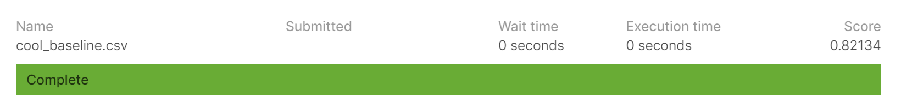
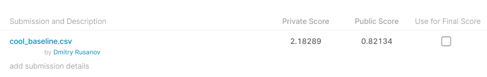

## [Car plates OCR](https://www.kaggle.com/c/car-plates-ocr-made/overview)
### Evaluation

Цель – найти и распознать текст всех номеров на изображении. Для решения задачи, очевидно, потребуется сеть для поиска номеров, но ее качество напрямую мы не оцениваем, только OCR номеров.

При сабмите для каждого изображения ответом является cтрока, составленная из всех номеров, соединенных через пробел.
Номера должны быть отсортированы по левой нижней X-координате баундинг бокса, т.е. слева направо.

Нельзя использовать сторонние данные (исключение - предобученные модели из репозиториев вроде torchvision использовать можно).

## Идея решения
Для решения задачи были разобраны [бейзлайн от преподавателей](https://github.com/BorisLestsov/MADE/tree/master/contest2) и одного из слушателей курса [бейзлайн Алексея Ярошенко](https://github.com/alexyar88/car-plate-numbers-ocr).

Для отсева некачественных данных были дообучены модели Unet (detection) и ResNet18 (recognition) из бейзлана преподавателей на нескольких эпохах без изменения гиперпараметров. Затем Выброшены картинки для которых предсказанные номера отличались достаточно сильно.

Затем на этих данных обучены модели MaskRCNN (detection) и CRNN (recognition) из второго бейзлайна, в котором были изменены гиперпараметры у scheduler ReduceLROnPlateau увеличена частота снижения lr до patience=2 и уменьшено число эпох (по одной на каждую модель) т.к. модели достаточно быстро сходились.

В итоге можно сказать, что не хватает обработки для сильно повернутых или вовсе перевернутых номеров. Вероятно помогли бы аугментации в виде поворотов картинок тестового датасета.

### Итоговый результат

